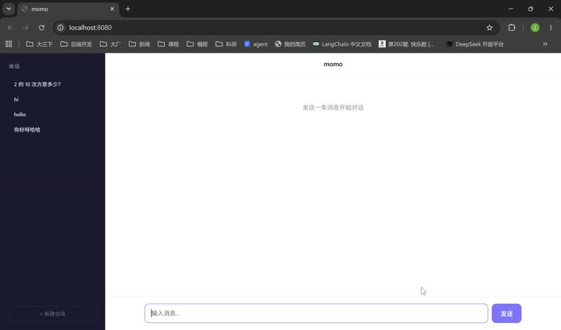

# momo — AI Agent Runtime

A from-scratch AI Agent Runtime in Go, built without any agent frameworks. Supports tool registration with JSON Schema, LLM autonomous decision-making, multi-turn multi-session conversations with real-time streaming, and disk-persisted session history.

## Demo

<a href="https://github.com/kkmkoi/momo/raw/refs/heads/main/demo/momo-demo.mp4">
  
</a>

> 点击图片观看演示视频（momo 的实时流式响应、工具调用和多会话管理）。

## Architecture

```
cmd/server/main.go           Entry point, HTTP server
internal/
  agent/
    agent.go                  Core agent loop + tool execution
    tool.go                   Tool interface + Registry + JSON Schema
    session.go                Session management + persistence + OpenAI format
    context.go                Context compression (turn-based, non-destructive)
    prompts.go                Go template system prompt (embedded templates)
    store.go                  JSON file-backed session persistence
    templates/
      momo.md.tpl             Main system prompt (rules, tools, workflow)
      title.md                Session title generation prompt
      summary.md              Context summary prompt
  tools/
    calculator.go             Arithmetic expression evaluator
    web.go                    Web fetch / search (URL fetching + HTML extraction)
    read_docs.go              Local file reader
    time.go                   Current date/time
    weather.go                Real-time weather (wttr.in)
  web/
    handler.go                Web UI with SSE streaming
```

### Core Loop

```
User Input → LLM → Tool Call? → Execute → LLM → Tool Call? ...
                ↓                          ↓
          Final Answer              Streaming via SSE
```

### Key Features

- **Tool Registration**: Each tool implements `Tool` interface with name, description, and JSON Schema parameters. LLM autonomously decides which tool to call.
- **Template System Prompt**: `momo.md.tpl` rendered with env data (date, platform, working dir) — no hardcoded prompt strings.
- **SSE Streaming**: Tool calls and results streamed to frontend via NDJSON over POST, no polling.
- **Real-time Thinking Display**: 🔧 tool calls, 📎 results, 🤔 LLM thinking shown live, latest step auto-expands and flows like water.
- **Concurrent Sessions**: Independent sessions with per-session mutex, concurrent-safe. Switch between sessions freely — each maintains its own context.
- **Disk Persistence**: Sessions saved as JSON files, survive server restart. Original messages never deleted — compression only affects LLM context.
- **Turn-based Context Compression**: 100-turn limit, oldest turns summarized into compact text when exceeded. Original data preserved on disk.
- **Concurrency-safe**: `sync.RWMutex` on Session, `SetStatus()` for atomic status updates, per-request event callbacks via context (no shared mutable state).

### Tools

| Tool           | Description                                                               |
| -------------- | ------------------------------------------------------------------------- |
| `calculator` | Arithmetic expression evaluator (+, -, *, /, **, sqrt, sin, cos, etc.)    |
| `web`        | Fetch any URL and return readable text content. Also used for web search. |
| `read_docs`  | Read any local file.                                                      |
| `get_time`   | Get current date and time.                                                |
| `weather`    | Real-time weather via wttr.in (free, no API key).                         |

## Quick Start

### Prerequisites

- Go 1.22+
- OpenAI API key (or any OpenAI-compatible API)

### Run

```bash
# Set your API key
export OPENAI_API_KEY=sk-...

# Run the web server
go run ./cmd/server/

# With custom model and API endpoint
go run ./cmd/server/ --model gpt-4o-mini --api-url https://api.openai.com/v1
```

Open http://localhost:8080 in your browser.

### Usage Examples

1. **Calculator**: "What is 2 + 2?" or "Calculate sqrt(144) * 3"
2. **Web**: "What's the latest AI news?" or "Fetch https://example.com"
3. **Read Docs**: "Read the file README.md"
4. **Weather**: "What's the weather in Tokyo?"
5. **Multi-session**: Open sidebar, create new sessions, ask different questions in parallel

## Configuration

```bash
go run ./cmd/server/ \
  --api-key sk-... \           # OpenAI API key (default: OPENAI_API_KEY env)
  --model gpt-4o-mini \         # LLM model
  --api-url https://api.openai.com/v1 \  # OpenAI-compatible API base
  --port 8080 \                 # HTTP server port
  --max-turns 999 \             # Max turns per request
  --data-dir ./data             # Session persistence directory
```

## Testing

```bash
go test ./...
```

## Dependencies

- `github.com/sashabaranov/go-openai` — OpenAI API client
- `golang.org/x/net` — HTML parsing for web content
